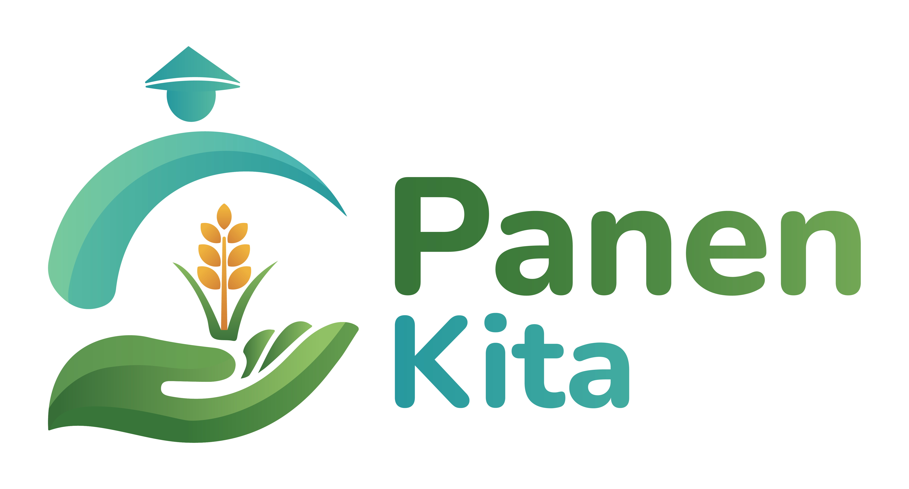

<div align="center">
  <a href="https://panenkita.com" target="_blank">
    
  </a>
  <h1 align="center">PanenKita</h1>
  <p align="center">
    <b>Website Resmi PanenKita - Menghubungkan Petani dengan Pasar yang Lebih Luas.</b>
    <br />
    <a href="#fitur-utama">Fitur Utama</a> •
    <a href="#teknologi-yang-digunakan">Teknologi</a> •
    <a href="#mulai">Mulai</a> •
    <a href="#struktur-proyek">Struktur Proyek</a> •
    <a href="#kontribusi">Kontribusi</a>
  </p>
</div>

---

## 🌾 Tentang PanenKita

**PanenKita** adalah platform digital berbasis web yang bertujuan untuk merevolusi sektor pertanian di Indonesia. Kami menyediakan jembatan digital antara petani lokal dengan konsumen, pedagang, dan industri, memotong rantai pasok yang panjang dan tidak efisien. Dengan PanenKita, petani mendapatkan akses pasar yang lebih adil dan transparan, sementara konsumen dapat menikmati produk pertanian segar berkualitas dengan harga terbaik.

Aplikasi ini dirancang untuk menampilkan informasi produk, mengelola stok, dan memberikan wawasan tentang visi dan misi kami dalam memajukan pertanian Indonesia.

## ✨ Fitur Utama

- **Beranda Dinamis**: Tampilan utama yang informatif dengan statistik _real-time_ dan testimoni.
- **Katalog Produk**: Galeri produk hasil panen yang lengkap dengan deskripsi dan informasi petani.
- **Manajemen Stok**: Halaman khusus untuk melihat ketersediaan stok produk secara _up-to-date_.
- **Tentang Kami**: Penjelasan mendalam mengenai visi, misi, dan nilai-nilai yang diusung PanenKita.
- **Desain Responsif**: Tampilan yang optimal di berbagai perangkat, mulai dari desktop hingga _mobile_.
- **Animasi & Interaksi**: Pengalaman pengguna yang lebih menarik dengan animasi saat _scroll_ dan _loading_.

## 🚀 Teknologi yang Digunakan

Proyek ini dibangun menggunakan teknologi web modern untuk memastikan performa, skalabilitas, dan kemudahan pengembangan.

- **Frontend**: [React.js](https://react.dev/)
- **Styling**: [Tailwind CSS](https://tailwindcss.com/)
- **Build Tool**: [Vite](https://vitejs.dev/)
- **Routing**: [React Router DOM](https://reactrouter.com/)
- **Icons**: [React Icons](https://react-icons.github.io/react-icons/)
- **Animations/Effects**: [React CountUp](https://github.com/glennreyes/react-countup), [React Intersection Observer](https://github.com/thebuilder/react-intersection-observer)
- **Linting**: [ESLint](https://eslint.org/)

## 🛠️ Mulai

Ikuti langkah-langkah berikut untuk menjalankan proyek ini di lingkungan lokal Anda.

### Prasyarat

Pastikan Anda sudah menginstal [Node.js](https://nodejs.org/en) (disarankan versi LTS) dan npm/yarn di mesin Anda.

### Instalasi

1.  **Clone repositori ini:**

    ```bash
    git clone https://github.com/panenkita/web-panenkita.git
    ```

2.  **Masuk ke direktori proyek:**

    ```bash
    cd web-panenkita
    ```

3.  **Instal semua dependensi:**
    ```bash
    npm install
    ```

### Menjalankan Aplikasi

Untuk menjalankan aplikasi dalam mode pengembangan, gunakan perintah:

```bash
npm run dev
```

Buka browser Anda dan kunjungi `http://localhost:5173` (atau port lain yang ditampilkan di terminal).

### Skrip yang Tersedia

- `npm run dev`: Menjalankan server pengembangan Vite.
- `npm run build`: Mem-build aplikasi untuk produksi di dalam folder `dist`.
- `npm run lint`: Menjalankan linter ESLint untuk memeriksa kualitas kode.
- `npm run preview`: Menjalankan server lokal untuk melihat hasil build produksi.

## 📂 Struktur Proyek

```
web-panenkita/
├── public/
├── src/
│   ├── assets/         # Gambar, logo, dan aset statis lainnya
│   ├── components/     # Komponen React yang dapat digunakan kembali (Header, Footer)
│   ├── data/           # Data dummy atau statis
│   ├── pages/          # Komponen untuk setiap halaman (Beranda, Produk, dll.)
│   ├── App.jsx         # Komponen utama dan routing aplikasi
│   ├── index.css       # File CSS global
│   └── main.jsx        # Titik masuk aplikasi React
├── .eslintrc.cjs
├── index.html
├── package.json
├── tailwind.config.js
└── vite.config.js
```

## 🖼️ Tampilan Aplikasi

<div align="center">
  
  <p><i>Tampilan Halaman Beranda PanenKita</i></p>
</div>

## 🤝 Kontribusi

Kami sangat terbuka untuk kontribusi dari komunitas. Jika Anda ingin berkontribusi, silakan lakukan _fork_ pada repositori ini dan buat _pull request_. Untuk perubahan besar, mohon buka _issue_ terlebih dahulu untuk mendiskusikan apa yang ingin Anda ubah.

---

<div align="center">
  <b>© 2024 PanenKita - Majukan Pertanian Indonesia!</b>
</div>
 Vite

This template provides a minimal setup to get React working in Vite with HMR and some ESLint rules.

Currently, two official plugins are available:

- [@vitejs/plugin-react](https://github.com/vitejs/vite-plugin-react/blob/main/packages/plugin-react) uses [Babel](https://babeljs.io/) for Fast Refresh
- [@vitejs/plugin-react-swc](https://github.com/vitejs/vite-plugin-react/blob/main/packages/plugin-react-swc) uses [SWC](https://swc.rs/) for Fast Refresh

## Expanding the ESLint configuration

If you are developing a production application, we recommend using TypeScript with type-aware lint rules enabled. Check out the [TS template](https://github.com/vitejs/vite/tree/main/packages/create-vite/template-react-ts) for information on how to integrate TypeScript and [`typescript-eslint`](https://typescript-eslint.io) in your project.
